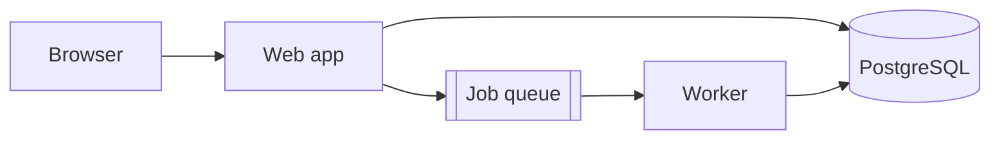
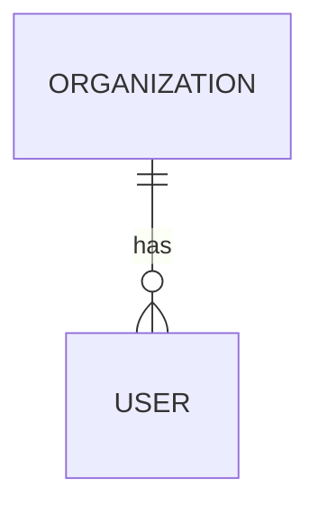
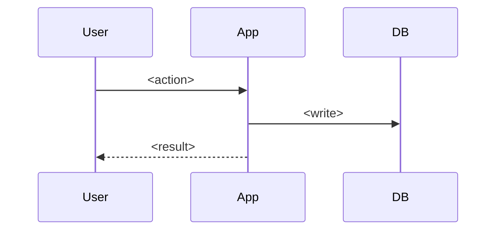

<!--
Architecture document template.
Fill every section, delete this comment block, print the whole thing in chat,
then save it as docs/architecture.md in the project (unstaged).
Format rules: references/output-format.md
-->

# Architecture — <system name>

- **Version:** v1 · **Status:** Proposed
- **Date:** YYYY-MM-DD
- **Authors:** <names> (with the `architecture-design` skill)
- **Stack:** <language/framework · database · hosting>

<Three sentences: what the system does, the shape chosen, the driver that most shaped it.>

## Overview & goals

- **Purpose:** <one sentence>
- **Success (3 months after launch):** <criterion>
- **User types:** <role — what they do>

## Non-goals (v1)

- <feature or quality> — deferred: <reason>

## Constraints & drivers

**Constraints**

- Team: <n engineers, stack>
- Deadline: <date, what drives it>
- Budget: <infra per month>
- Compliance: <none | GDPR | …>
- Existing systems: <list or none>

**Drivers (ranked)**

1. **D1** — <driver>
2. **D2** — <driver>
3. **D3** — <driver>

## Quality attributes

| Attribute | Target | How the design meets it |
|---|---|---|
| Availability | <99.5% monthly (assumed)> | |
| Latency | <p95 < 1 s on the money flow> | |
| Data protection | | |
| Consistency | | |

## High-level architecture

<One paragraph naming each box and its responsibility.>

## Components & modules

| Module | Owns (entities) | Exposes | Depends on |
|---|---|---|---|
| | | | |

## Data model & storage

- **Primary store:** <PostgreSQL — D?>
- **Files:** <object storage — D?>
- **Cache / search:** <none in v1 | …>
- **Tenancy:** <model and enforcement>
- **Volumes & retention:** <biggest table, storage, retention>
- **Backups:** <what, how often, restore tested how>
- **PII inventory:** <field — why kept — retention>

## Key flows

### <Money flow name>

Failure handling: <two lines>.

## Integrations

| Service | Purpose | Direction | Failure mode | Owner |
|---|---|---|---|---|
| | | outbound | | |

## Infrastructure & deployment

- **Hosting:** <platform>
- **Environments:** production, staging
- **CI/CD:** <pipeline in one line>
- **Deploy / rollback:** `<command>` / `<command>`
- **Config & secrets:** <host secret store; placeholders only in the repo>
- **Estimated cost:** <USD/month or "not estimated">

## Cross-cutting concerns

**Authentication & authorization** — <mechanism; who can see what>

**Security** — <baseline + compliance-specific items>

**Observability** — <error tracking, logs, uptime check; who is paged>

**Performance** — <the two or three things that keep the targets>

## Decision log

| # | Decision | Alternatives considered | Rationale (drivers) | Status |
|---|---|---|---|---|
| 1 | | | | Accepted |

## Risks & open questions

| Item | Why it matters | Owner | Needed by |
|---|---|---|---|
| | | | |

## Evolution path

- <change> — trigger: <measurable condition>

---
_Generated by the `architecture-design` skill · assumptions marked (assumed) · interview phases skipped: none_
