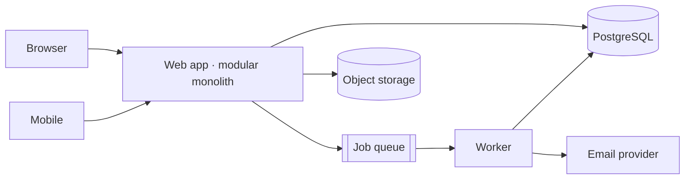

# Output Format

The document saved to `docs/architecture.md`. Template: `assets/architecture.md`. Sections in this order; omit a section only when it's genuinely empty and say so in one line (`_No external integrations in v1._`).

## 1. Header

```markdown
# Architecture — <system name>

- **Version:** v1 · **Status:** Proposed | Accepted
- **Date:** YYYY-MM-DD
- **Authors:** <who answered the interview> (with the `architecture-design` skill)
- **Stack:** <language/framework, database, hosting — one line>
```

Then a three-sentence summary: what the system does, the shape chosen, the driver that most shaped it.

Revise mode adds `## Changes since last version` right after the header: a bulleted list of what moved and why.

## 2. Overview & goals

The one-sentence purpose, the success criterion, user types. Short.

## 3. Non-goals (v1)

Bulleted. Features and qualities explicitly deferred, each with a one-clause reason ("deferred: no customer asked yet"). This section is what protects the design from scope creep.

## 4. Constraints & drivers

Two lists:

- **Constraints** — team, deadline, budget, compliance, mandated tech, existing systems.
- **Drivers** — the 3–6 ranked drivers from synthesis, numbered. Every decision-log row references at least one by number.

## 5. Quality attributes

Table: `| Attribute | Target | How the design meets it |`. Targets in numbers where the interview gave them (`99.5% monthly`, `p95 < 800 ms on the booking flow`); otherwise the phase default, marked *(assumed)*.

## 6. High-level architecture

A mermaid diagram of the runtime shape — clients, the app, workers, database, object storage, external services. Keep it to what exists in v1.

````markdown

````

Follow with a paragraph naming each box and what it's responsible for.

## 7. Components & modules

For a modular monolith: a table `| Module | Owns (entities) | Exposes | Depends on |`. For services: the same per service plus the protocol between them. This is where module boundaries are made explicit.

## 8. Data model & storage

- The core entities and relationships — a mermaid `erDiagram` for up to ~12 entities, prose beyond that.
- Storage decisions: primary DB, files, cache, search — each in one line with the driver.
- Tenancy model and how isolation is enforced.
- Volumes, retention, backups/restore, and the PII inventory (which fields, why kept, how long).

## 9. Key flows

One to three `sequenceDiagram`s for the money flow and any flow with non-obvious mechanics (payment webhook, real-time update, file processing). Each with a two-line note on failure handling.

## 10. Integrations

Table: `| Service | Purpose | Direction | Failure mode | Owner |`. Inbound (public API, webhooks you receive) and outbound (providers you call).

## 11. Infrastructure & deployment

Hosting, environments, CI/CD pipeline in a few lines, deploy and rollback commands, config/secrets handling (placeholders only — `your-token`, `your.domain.com`), and cost estimate if the interview gave a budget.

## 12. Cross-cutting concerns

Short subsections: **Authentication & authorization**, **Security**, **Observability** (what's tracked, who's paged), **Performance** (the two or three things that keep the targets in section 5).

## 13. Decision log

The heart of the document.

```markdown
| # | Decision | Alternatives considered | Rationale (drivers) | Status |
|---|---|---|---|---|
| 1 | Modular monolith, one deployable | Microservices; serverless | D1 (2 engineers, 3 months), D3 (no independent scaling need) | Accepted |
| 2 | PostgreSQL as the only datastore | Postgres + Mongo for documents | `jsonb` covers the flexible fields; D1 | Accepted |
```

Rules: every row has at least one alternative and at least one driver; a decision the user made against the recommendation is recorded with *their* reason and marked `Accepted (user decision)`; superseded rows stay, marked `Superseded by #N`.

## 14. Risks & open questions

Table: `| Item | Why it matters | Owner | Needed by |`. Every assumption taken from a phase default goes here, plus unknown loads, unconfirmed compliance scope, integrations without docs. Never left empty — a v1 without open questions wasn't interviewed hard enough.

## 15. Evolution path

What changes after v1 and the **trigger** for each: "extract billing to a service when a second team owns it", "add a read replica when p95 on reports > 5 s", "move to dedicated search when relevance complaints exceed X". Everything the user wanted and was talked out of lands here with its trigger.

## 16. Footer

```markdown
---
_Generated by the `architecture-design` skill · assumptions marked (assumed) · interview phases skipped: <list, or "none">_
```

## Rules

- **No invented numbers.** A figure is either from the interview, from the repo, or marked *(assumed)* and listed under open questions.
- **Drivers by number.** A decision without a driver reference is incomplete.
- **Diagrams show what exists in v1**, not the evolution path.
- **Print in full in chat, then save the identical text.**
- **Hard-wrap nothing** inside tables; keep prose paragraphs short so the doc reads well as a diff.
